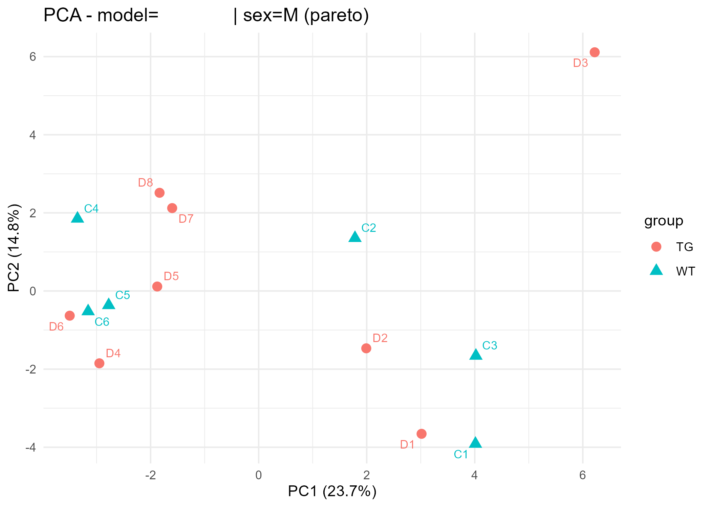
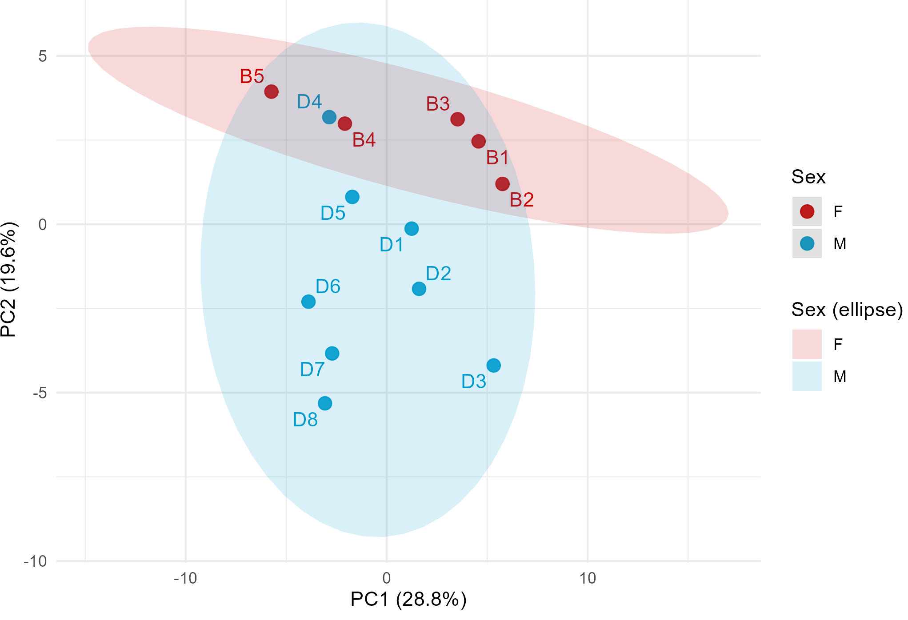
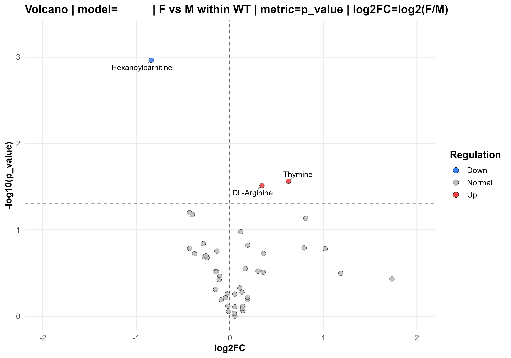
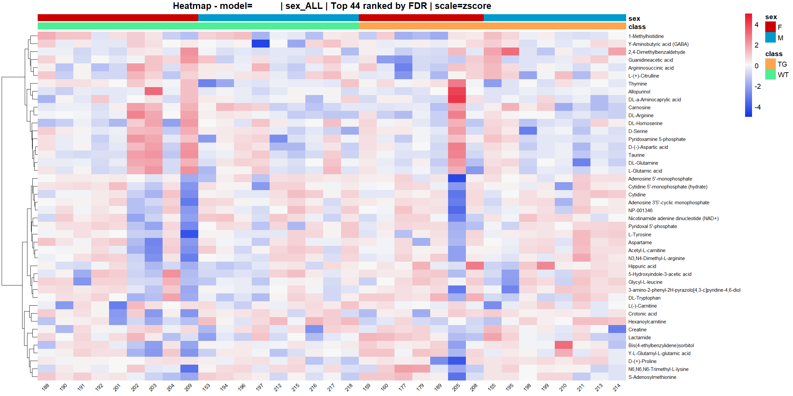

# Compound Discoverer — Metabolomics Pipeline (R)

A simple, modular R pipeline for processing untargeted metabolomics data exported from Compound Discoverer.

Key features

- Compound Discoverer table refinement
- Normalization, filtering and quality control
- Statistical analysis and visualizations (PCA, volcano plots, heatmaps)
- Exports compatible with MetaboAnalyst
- Run via script (`Rscript`), `source()` in R, or the Shiny app

---

## Overview

This repository processes feature tables exported from Compound Discoverer together with experimental metadata and produces cleaned assay matrices, filter audit reports, PCA outputs, statistical results, plots (volcano, heatmaps) and downstream export tables.

The main workflow is orchestrated by `pipeline/run_pipeline.R` and steps are modularized in `pipeline/R/00` through `pipeline/R/12`.

---

## Quickstart

Clone the repository and run the pipeline with these minimal steps:

```powershell
git clone https://github.com/ianca-kpa/compound-discoverer-metabolomics-pipeline-in-R.git
cd compound-discoverer-metabolomics-pipeline-in-R
# copy and edit the local settings file
Copy-Item pipeline/config/settings.example.R pipeline/config/settings.R
# run the pipeline
Rscript pipeline/run_pipeline.R
# or, interactively in R / RStudio:
source("pipeline/run_pipeline.R")
# to open the Shiny app:
shiny::runApp(".")
```

---

## Repository structure

```
. 
|-- app.R
|-- app/
|   |-- global.R
|   |-- server.R
|   |-- ui.R
|   `-- assets/
|-- pipeline/
|   |-- run_pipeline.R
|   |-- config/
|   |   `-- settings.example.R
|   `-- R/
|       |-- 00_packages.R
|       |-- 01_validation.R
|       |-- 02_comparisons.R
|       |-- 03_helpers_io_log.R
|       |-- 04_metadata.R
|       |-- 05_features_assay.R
|       |-- 06_normalization_filters.R
|       |-- 07_duplicates.R
|       |-- 08_exports.R
|       |-- 09_pca.R
|       |-- 10_stats_volcano.R
|       |-- 11_heatmaps.R
|       `-- 12_main_pipeline.R
|-- images/
`-- output/ (generated at runtime)
```

---

## Requirements

- R (recommended: ≥ 4.5.3)
- RStudio (optional, recommended for interactive work)
- Required CRAN/Bioconductor packages are installed by `pipeline/R/00_packages.R` when the pipeline runs.

---

## Initial setup

Create a local copy of `settings.example.R` as `pipeline/config/settings.R` and edit input paths, comparison groups and filter parameters.

In the R console:

```r
file.copy(
  "pipeline/config/settings.example.R",
  "pipeline/config/settings.R",
  overwrite = FALSE
)
```

Or in PowerShell:

```powershell
Copy-Item pipeline/config/settings.example.R pipeline/config/settings.R
```

Key fields to adjust in `settings.R`:

- `cd_file_path` — Compound Discoverer file path
- `cd_sheet` — sheet index or name for the CD file
- `metadata_path` — metadata spreadsheet path
- `metadata_sheet` — sheet index or name for metadata
- `reference_path` — optional reference table path
- `reference_sheet` — sheet index or name for reference table
- `use_reference_file` — TRUE/FALSE to enable reference usage
- `comparison_group_control`, `comparison_group_treatment` — labels for control and treatment groups
- `output_dir` — output directory
- filter parameters (e.g. `missing_exclusion_max_fraction`, `presence_filter_min_fraction`, `impute_half_min`)

---

## Running the pipeline

Options:

- Via Shiny (graphical interface):

```r
shiny::runApp(".")
```

- Directly in R/RStudio:

```r
source("pipeline/run_pipeline.R")
```

- From the command line:

```powershell
Rscript pipeline/run_pipeline.R
```

---

## Expected outputs

Results are written to `output/` (or to the folder defined by `output_dir`). Main outputs include:

- `PIPELINE_LOG.txt`
- filter audit tables
- processed matrices
- statistical results
- `plots/` folders with PCA, volcano and heatmaps
- MetaboAnalyst-ready exports

---

## Troubleshooting

- `pipeline/config/settings.R not found`: copy `pipeline/config/settings.example.R` to `pipeline/config/settings.R` and update paths.
- Package installation errors: run `pipeline/R/00_packages.R` or re-run the pipeline to install dependencies.
- Spreadsheet read errors: check file extension, sheet name/index, and paths in `settings.R`.

---


## Examples

Example figures are in the `images/` directory. A few examples are shown below.

PCA example:



PCA example 2:



Volcano example:



Heatmap example:


