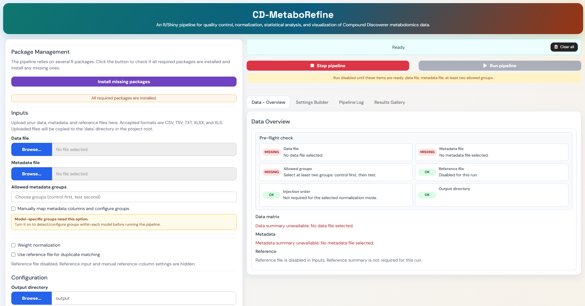
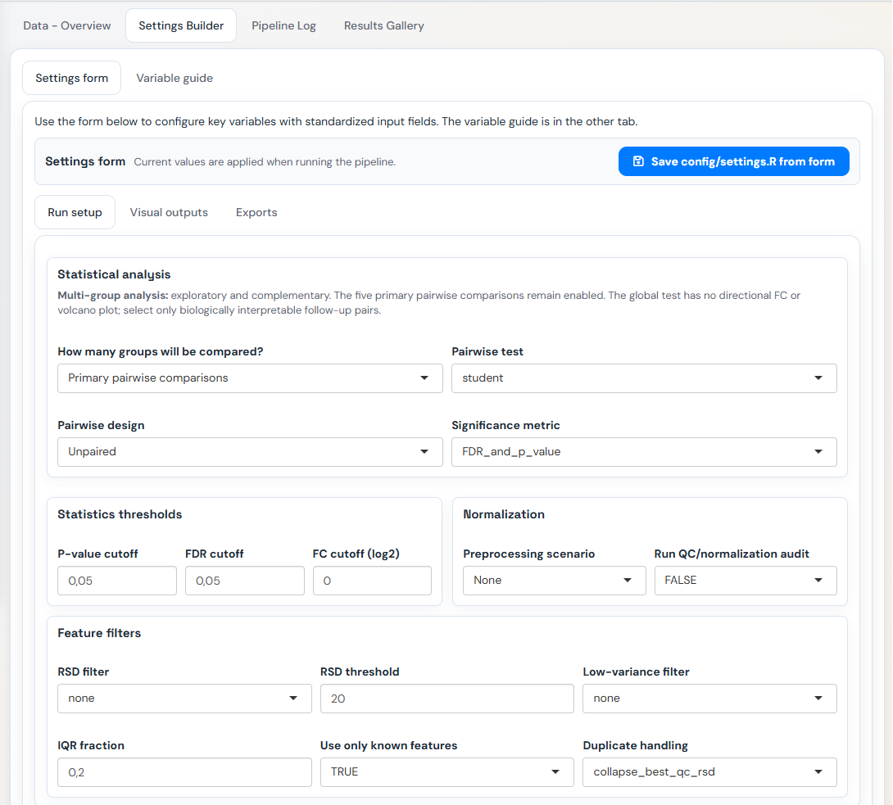
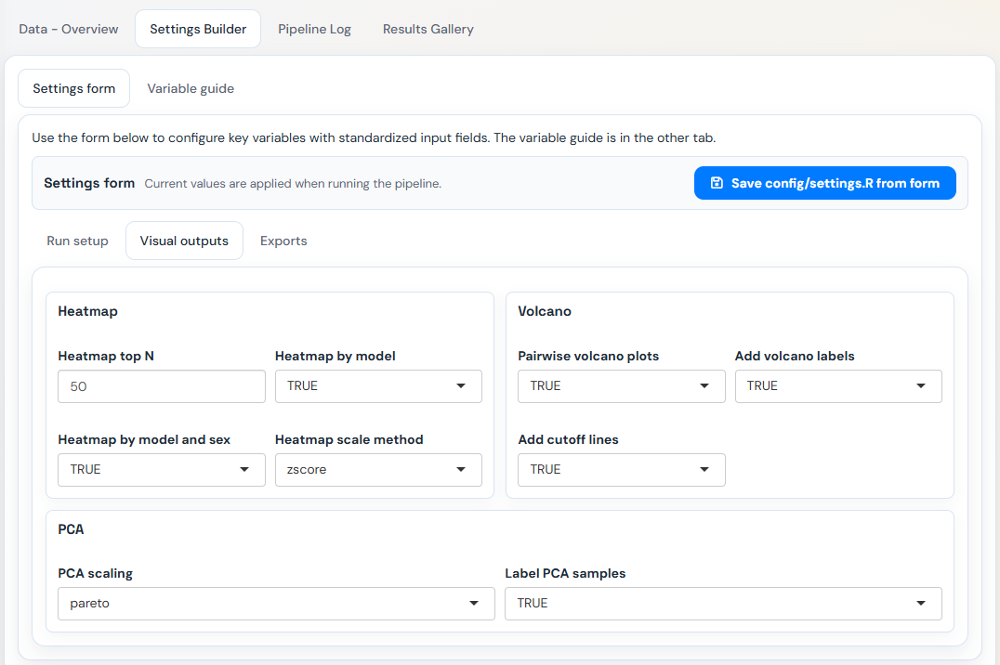
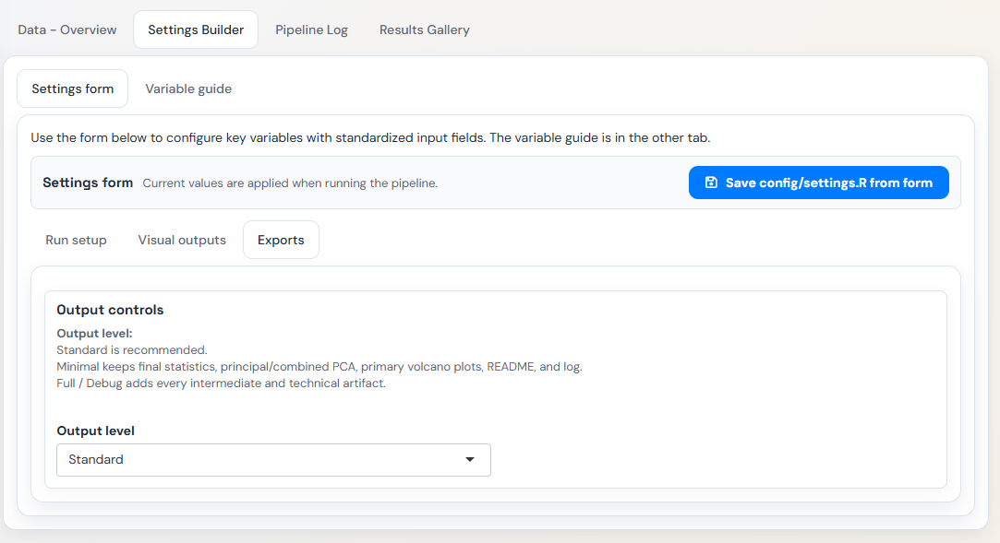
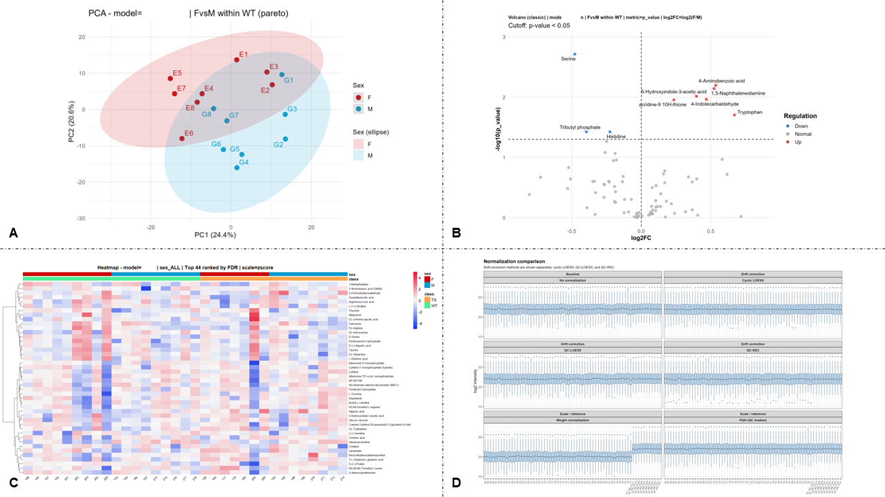

# CD-MetaboRefine

**Compound Discoverer Refinement and Metabolomics Pipeline**

An R/Shiny pipeline for quality control, normalization, statistical analysis, and visualization of Compound Discoverer metabolomics data.

## Overview

The pipeline combines Compound Discoverer feature tables with experimental metadata and produces refined assay data, quality-control summaries, statistical analyses and visualizations. It can be run from the command line, from R/RStudio, or through the included Shiny application.

Main capabilities:

- feature-table refinement, filtering and duplicate handling;
- optional weight normalization;
- QC-RSC, QC-LOESS, cyclic LOESS, PQN-QC, PQN-sample and no-normalization scenarios;
- QC diagnostics and normalization audit outputs;
- PCA, pairwise statistics with optional batch adjustment through `limma`, volcano plots and heatmaps;
- exploratory multi-group analysis;
- MetaboAnalyst-compatible exports;
- sample-level diagnostic reports;
- execution through Rscript, R/RStudio or the Shiny application.

The workflow is orchestrated by `pipeline/run_pipeline.R` and implemented in the modules under `pipeline/R/`.

## Quick start

```powershell
git clone https://github.com/ianca-kpa/compound-discoverer-metabolomics-pipeline-in-R.git
cd compound-discoverer-metabolomics-pipeline-in-R
Copy-Item pipeline/config/settings.example.R pipeline/config/settings.R
Rscript pipeline/run_pipeline.R
```

To run interactively in R:

```r
source("pipeline/run_pipeline.R")
```

To open the Shiny application:

```r
shiny::runApp(".")
```

## Requirements

- R ≥ 4.5.3 recommended;
- RStudio optional;
- CRAN and Bioconductor dependencies declared in `pipeline/R/00_packages.R`.

The pipeline checks its dependencies when it starts.

## Input data

The main workflow expects:

- a Compound Discoverer feature table, usually an `.xlsx` file;
- a metadata table with sample identifiers and biological annotations;
- an optional reference/annotation table;
- a complete injection-order file when using `qcrsc` or `qc_loess`.

Metadata column names are auto-detected when possible. The most important fields are:

| Field | Purpose |
|---|---|
| `sample` | Sample name matching the Compound Discoverer `Area: <sample>` columns. |
| `group` | Biological group used in comparisons. |
| `sex` | Sex or subgroup label used by sex-stratified comparisons. |
| `model` | Model/cohort label used to split downstream analyses. |
| `weight` | Optional sample weight/mass used for weight normalization. |
| `batch` | Optional batch label used by QC-RSC and by unpaired `limma` comparisons. |

## Configuration

Copy `pipeline/config/settings.example.R` to `pipeline/config/settings.R`. The latter is the active local configuration.

Important settings include:

- `cd_file_path` and `cd_sheet`;
- `metadata_path` and `metadata_sheet`;
- `reference_path`, `reference_sheet` and `use_reference_file`;
- `comparison_group_control` and `comparison_group_treatment`;
- `normalization_mode`, `use_weight_normalization` and normalization parameters;
- filtering and duplicate-handling parameters;
- `comparison_mode` and multi-group parameters;
- `output_dir` and `output_level`.

### Normalization scenarios

`normalization_mode` controls the main preprocessing scenario.

| Mode | Description |
|---|---|
| `none` | Uses filtered intensities without normalization. |
| `weight` | Weight-only workflow. In Shiny this is produced by selecting `none` plus weight normalization. |
| `qcrsc` | QC-RSC drift correction. Requires complete injection order and enough QC samples. |
| `qc_loess` | QC-based LOESS drift correction. Requires complete injection order and enough QC samples. |
| `cyclic_loess` | Cyclic LOESS normalization through `limma::normalizeCyclicLoess`. |
| `pqn_qc` | Probabilistic quotient normalization using QC samples as the reference. |
| `pqn_sample` | Probabilistic quotient normalization using biological samples as the reference. Useful when QC samples are absent or too few. |

When `use_weight_normalization <- TRUE` with `qcrsc` or `qc_loess`, drift correction is applied first and weight normalization is then applied only to biological samples. The pipeline writes a weight-normalization audit when Standard or Full / Debug outputs are enabled.

When metadata contains two or more valid `batch` values, unpaired `limma`
comparisons include batch as a covariate. The pipeline stops if batch and the
biological comparison are fully confounded. Student, Welch and Wilcoxon tests
cannot adjust for batch and are blocked when multiple batches are present.
QC-RSC also uses the metadata batch values when available.

### Output levels

`output_level <- "standard"` controls which artifacts are written. It does not change the statistical calculations.

| Level | Outputs |
|---|---|
| `minimal` | Final statistics Excel per model, principal PCA, combined PCA when applicable, volcano plots for the five primary pairwise comparisons, `README.txt` and `PIPELINE_LOG.txt`. |
| `standard` | Everything in Minimal, plus main heatmaps, summarized QC and normalization audits, QC-RSD and drift-correlation summaries when available, and enabled multi-group outputs. This is the default. |
| `full_debug` | All final, intermediate and technical artifacts, including matrices, `BIO_ONLY`, `WITH_QC`, complete audits, technical plots, CSV, TXT and XLSX outputs. |

Legacy configurations containing `minimal_output <- TRUE` are interpreted as `output_level <- "minimal"`.

### Filtering and MetaboAnalyst compatibility

The active configuration supports missingness filtering, presence filtering, optional half-minimum imputation, QC-RSD/RSD variants, duplicate collapsing, and an optional low-variance IQR filter.

For MetaboAnalyst-style comparisons, the most relevant settings are:

- `low_variance_filter_method <- "iqr"`;
- `low_variance_filter_rounding <- "ceiling"`;
- `pca_scaling <- "pareto"`;
- `heatmap_scale_method <- "zscore"`;
- `export_metaboanalyst_ready <- TRUE`.

### Multi-group analysis

Multi-group analysis is exploratory and complements these five primary pairwise comparisons:

- `ALL_TGvsWT`;
- `F_TGvsWT`;
- `M_TGvsWT`;
- `TG_FvsM`;
- `WT_FvsM`.

`MULTIGROUP_GLOBAL` reports `p_value`, `FDR`, `test_type_used`, `groups_compared`, group/sample counts and one mean column per group. A significant ANOVA, Welch ANOVA or Kruskal-Wallis result indicates that at least one group differs, but does not provide a single numerator/denominator or direction of effect.

Therefore, `FC_num_over_den` and `log2FC_num_over_den` remain `NA`, and the global test does not generate Up/Down classification or volcano plots. Directional interpretation should use the primary comparisons or selected biologically meaningful pairwise follow-ups.

With Standard or Full / Debug output, enabled multi-group analysis produces:

- the `MULTIGROUP_GLOBAL` results sheet;
- multi-group PCA;
- top-feature multi-group heatmaps;
- `MULTIGROUP_README.txt` in each model statistics directory.

## Running the pipeline

### Shiny

```r
shiny::runApp(".")
```

### R or RStudio

```r
source("pipeline/run_pipeline.R")
```

### Command line

```powershell
Rscript pipeline/run_pipeline.R
```

## Output structure

Outputs are written under `output_dir`. The exact files depend on `output_level`, enabled analyses and available QC data.

```text
<output_dir>/
|-- README.txt
|-- PIPELINE_LOG.txt
|-- global/
|   |-- audits_global/
|   |-- exports_global/
|   `-- plots_global/
`-- <MODEL>/
    |-- stats/
    `-- plots/
        |-- pca/
        |-- volcano/
        |-- heatmap/              # Standard or Full / Debug
        `-- heatmap_significant/  # Full / Debug
```

Empty output directories are removed at the end of a successful run.

## Repository structure

```text
.
|-- app.R
|-- app/
|   |-- global.R
|   |-- server.R
|   |-- ui.R
|   |-- assets/
|   |   `-- styles.css
|   `-- helpers/
|       |-- helpers.R
|       |-- metadata_helpers.R
|       |-- server_data_overview_helpers.R
|       |-- server_gallery_helpers.R
|       |-- server_input_helpers.R
|       |-- server_pipeline_helpers.R
|       |-- server_settings_helpers.R
|       `-- server_util_helpers.R
|-- pipeline/
|   |-- run_pipeline.R
|   |-- config/
|   |   `-- settings.example.R
|   `-- R/
|       |-- 00_packages.R
|       |-- 01_validation.R
|       |-- 02_comparisons.R
|       |-- 03_helpers_io_log.R
|       |-- 03a_logging_helpers.R ... 03f_runtime_console_helpers.R
|       |-- 04_metadata.R
|       |-- 05_features_assay.R
|       |-- 06_normalization_filters.R
|       |-- 06a_normalization_core.R ... 06c_filter_helpers.R
|       |-- 07_duplicates.R
|       |-- 08_exports.R
|       |-- 09_pca.R
|       |-- 10_stats_volcano.R
|       |-- 10a_stats_core.R ... 10d_stats_exports.R
|       |-- 11_heatmaps.R
|       `-- 12_main_pipeline.R
|-- scripts/
|-- images/
`-- project/
```

The numbered compatibility modules (`03_helpers_io_log.R`, `06_normalization_filters.R` and `10_stats_volcano.R`) load their corresponding split helper modules.

## Shiny application

The Shiny interface provides file inputs, metadata mapping, normalization controls, output-level selection, a settings builder, execution controls, live logs and a results gallery. It can also warn before selecting heavier output levels and asks whether weight normalization should be applied after QC-RSC or QC-LOESS.

Recent app workflow helpers include:

- a Data Overview pre-flight check for data, metadata, allowed groups, reference file, injection order and output directory;
- a guarded Run button that stays disabled until the minimum required inputs are ready;
- an alert near `Manually map metadata columns and configure groups` when model-specific group configuration is needed;
- a Pipeline Log summary that highlights likely errors and warnings above the full log;
- Results Gallery filters for all figures, PCA, volcano plots, heatmaps, QC/normalization figures and other outputs.

For `qcrsc` and `qc_loess`, the Shiny app expects an injection-order upload in the current session before Run is enabled.

### Data overview



### Interactive settings builder

CD-MetaboRefine includes a Settings Builder that allows users to configure the main analysis options directly from the Shiny interface, including statistical analysis, normalization, filtering, visualization settings, and export level.

**Settings Builder overview:**  
(A) run setup, including statistical analysis, thresholds, normalization, filters, and duplicate handling;



(B) visual output settings for PCA, volcano plots, and heatmaps;



(C) export level configuration.



### Example outputs

CD-MetaboRefine generates exploratory, statistical, and quality-control visualizations, including PCA plots, volcano plots, heatmaps, and normalization comparison diagnostics.



**Example outputs generated by CD-MetaboRefine:**  
(A) PCA plot, (B) volcano plot, (C) heatmap, and (D) normalization comparison diagnostic plot.

## Troubleshooting

- **`pipeline/config/settings.R not found`**: copy `settings.example.R` to `settings.R` and update the paths.
- **Package installation errors**: run or source `pipeline/R/00_packages.R`, then restart the pipeline.
- **Spreadsheet read errors**: verify the file extension, sheet name/index and configured path.
- **Missing QC or injection-order error**: `qcrsc` and `qc_loess` require enough QC samples and a complete injection-order file.
- **Batch-adjustment error**: unpaired `limma` can adjust for batch only when batch is not fully confounded with the biological comparison. Student, Welch and Wilcoxon tests do not support batch adjustment in this pipeline.
- **Invalid weight error**: check the metadata weight/mass column or set `stop_on_invalid_weight <- FALSE` if invalid weights should be converted to `NA`.
- **Unexpectedly few or many files**: verify `output_level` in the active configuration or Shiny settings.

## Diagnostic scripts

The `scripts/` folder contains optional helpers around the main pipeline:

```powershell
Rscript scripts/diagnose_sample.R PCA_OUTLIERS data/MA_ACTIVE_duplicate_ONLY_GLOBAL_NO_QC.csv
Rscript scripts/diagnose_sample.R SAMPLE_ID output/<run>/global/exports_global/MA_ACTIVE_duplicate_ONLY_GLOBAL_NO_QC.csv path/to/metadata.xlsx output/diagnostics_SAMPLE_ID_metadata
Rscript scripts/generate_sample_report.R output/diagnostics_pca_outliers SAMPLE_ID
Rscript scripts/generate_qc_loess_weight_plot.R output/<run>/global/exports_global output/<run>/global/plots_global/normalization
```

See `scripts/README.md` for the full diagnostic workflow.
