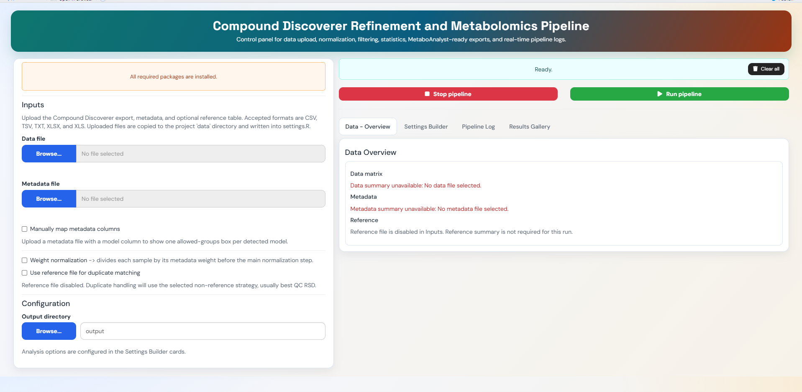
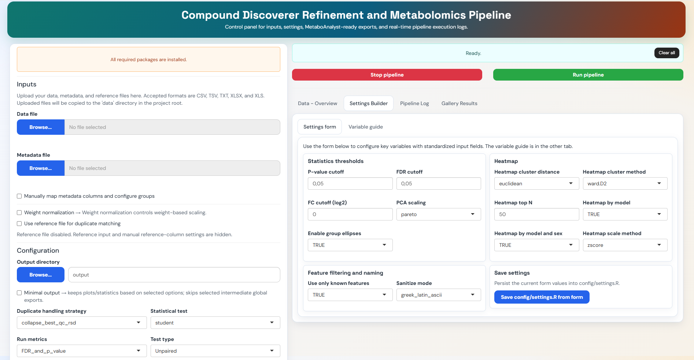

# Compound Discoverer Metabolomics Pipeline in R

A modular R pipeline and Shiny control panel for refining untargeted metabolomics data exported from Compound Discoverer.

The workflow reads a Compound Discoverer feature table, experimental metadata, and an optional reference table. It then produces cleaned assay matrices, normalization audits, feature-filter audits, duplicate-handling reports, PCA figures, volcano plots, heatmaps, statistical tables, and MetaboAnalyst-ready exports.

## Key Features

- Compound Discoverer feature-table refinement
- Metadata validation and optional manual metadata-column mapping
- Optional sample-weight normalization before the main normalization step
- Main normalization modes: `none`, `PQN`, and `QC_LOESS`
- Missingness, presence, RSD, QC RSD, and low-variance IQR filters
- Duplicate metabolite handling with optional reference-table matching
- Student, Welch, Wilcoxon, and limma statistical tests
- PCA, volcano plots, top heatmaps, and significant-feature heatmaps
- Per-model and sex-stratified comparisons
- MetaboAnalyst-ready export tables
- Shiny app for uploads, settings editing, real-time logs, and result browsing

## Repository Structure

```text
.
|-- app.R
|-- app/
|   |-- global.R              # Shiny helpers, settings form, glossary
|   |-- server.R              # Shiny server logic
|   |-- ui.R                  # Shiny interface
|   `-- assets/
|-- pipeline/
|   |-- run_pipeline.R        # Main script entry point
|   |-- config/
|   |   `-- settings.example.R
|   `-- R/
|       |-- 00_packages.R
|       |-- 01_validation.R
|       |-- 02_comparisons.R
|       |-- 03_helpers_io_log.R
|       |-- 04_metadata.R
|       |-- 05_features_assay.R
|       |-- 06_normalization_filters.R
|       |-- 07_duplicates.R
|       |-- 08_exports.R
|       |-- 09_pca.R
|       |-- 10_stats_volcano.R
|       |-- 11_heatmaps.R
|       `-- 12_main_pipeline.R
|-- images/
`-- output/                 # Generated at runtime, or another output_dir
```

## Requirements

- R 4.5.3 or newer is recommended
- RStudio is optional, but useful for interactive work
- Required CRAN/Bioconductor packages are declared in `pipeline/R/00_packages.R`

The pipeline and app attempt to install missing packages when they start. If package installation fails, run `pipeline/R/00_packages.R` directly and then rerun the pipeline.

## Quickstart

```powershell
git clone https://github.com/ianca-kpa/compound-discoverer-metabolomics-pipeline-in-R.git
cd compound-discoverer-metabolomics-pipeline-in-R

Copy-Item pipeline/config/settings.example.R pipeline/config/settings.R

Rscript pipeline/run_pipeline.R
```

Interactive alternatives:

```r
source("pipeline/run_pipeline.R")
shiny::runApp(".")
```

## Input Files

The pipeline expects:

- `cd_file_path`: Compound Discoverer export table with `Area:` sample columns
- `metadata_path`: metadata table with sample, group, sex, model, and optional weight columns
- `reference_path`: optional reference table used for duplicate matching

Accepted file formats are CSV, TSV, TXT, XLSX, and XLS. In the Shiny app, uploaded files are copied into the project `data/` folder and the configuration is updated automatically.

Metadata columns can be auto-detected from common names. If the file uses custom names, enable manual metadata mapping in the app or set the corresponding mapping values in `settings.R`.

## Configuration

Create a local settings file before running from script:

```r
file.copy(
  "pipeline/config/settings.example.R",
  "pipeline/config/settings.R",
  overwrite = FALSE
)
```

Important settings:

- `output_dir`: root folder for all outputs
- `comparison_group_control` and `comparison_group_treatment`: control and treatment labels used for comparisons
- `use_reference_file`: enables or disables reference-table use
- `duplicate_name_strategy`: controls how duplicate named features are kept or collapsed
- `use_weight_normalization`: divides sample intensities by sample weight before main normalization
- `normalization_mode`: chooses `none`, `PQN`, or `QC_LOESS`
- `rsd_filter_metric`, `rsd_thresholds`, and `active_variant`: create and select QC RSD or sample RSD variants
- `low_variance_filter_method` and `low_variance_filter_fraction`: optionally remove the lowest-IQR features
- `p_value_cutoff`, `fdr_cutoff`, and `fc_cutoff_log2`: statistical and plotting thresholds
- `pca_scaling` and heatmap settings: control visual output scaling and clustering
- `minimal_output`: skips selected intermediate global exports while keeping selected plots and statistics

## Normalization Workflow

Normalization happens in two stages:

1. Optional weight normalization with `use_weight_normalization`.
2. Main normalization with `normalization_mode`.

Available main normalization modes:

- `none`: keeps the post-weight matrix unchanged.
- `PQN`: applies probabilistic quotient normalization using QC samples as the reference basis and writes a PQN factor audit.
- `QC_LOESS`: corrects injection-order signal drift using QC samples and writes a per-feature QC-LOESS audit.

`QC_LOESS` requires enough valid QC points per feature. The minimum is controlled by `loess_min_qc_points`, and smoothness is controlled by `QC_LOESS_span`.

## Filtering And Duplicate Handling

The pipeline applies filters in this general order:

1. Missingness exclusion
2. Presence filtering and optional half-minimum imputation
3. Known-only filtering, if enabled
4. RSD or QC RSD variant creation
5. Optional low-variance IQR filtering
6. Duplicate metabolite handling

RSD filtering creates named variants such as `QC_RSD20` or `RSD20`. `active_variant` selects which variant continues into downstream statistics and plots. When `rsd_filter_metric` is `none`, the pipeline uses `BASE`.

Duplicate strategies:

- `reference_or_best_qc_rsd`: prefer reference-table RT matching, then best QC RSD fallback
- `collapse_best_qc_rsd`: keep the duplicate with the best QC RSD
- `collapse_mean`: average duplicate feature intensities
- `collapse_sum`: sum duplicate feature intensities
- `keep_separate`: keep duplicate features separate

## Running With The Shiny App

Start the app from the repository root:

```r
shiny::runApp(".")
```

The app provides:

- Input upload controls for data, metadata, and optional reference files
- Manual metadata and reference-column mapping
- A settings builder with standardized controls
- A variable guide that explains each exposed setting
- Save-to-`settings.R` support
- Pipeline run/stop controls
- A live pipeline log
- Data overview summaries
- A results gallery with normalization, QC/PCA, filter, and figure summaries

## Expected Outputs

Outputs are written to `output/` unless `output_dir` is changed.

Common outputs include:

- `PIPELINE_LOG.txt`
- `global/audits_global/filter_summary.csv`
- Missingness, presence, RSD, QC RSD, IQR, and duplicate audit tables
- Processed assay matrices and named feature tables
- PQN or QC-LOESS normalization audit files, depending on selected mode
- PCA figures
- Volcano plots
- Top and significant heatmaps
- Per-model Excel statistics workbooks
- Plain-text significant metabolite lists
- MetaboAnalyst-ready export tables

## Troubleshooting

- `pipeline/config/settings.R not found`: copy `pipeline/config/settings.example.R` to `pipeline/config/settings.R`.
- Package installation errors: run `source("pipeline/R/00_packages.R")` and check that R can install CRAN/Bioconductor packages.
- Spreadsheet read errors: check the path, extension, and sheet name or index.
- No `Area:` columns found: check that the Compound Discoverer export contains sample intensity columns.
- Metadata validation fails: verify sample, group, sex, model, and weight column names or use manual mapping in the app.
- QC-LOESS fails or corrects few features: check that QC samples exist, injection order is available, and each feature has at least `loess_min_qc_points` valid QC values.
- Reference duplicate matching falls back to QC RSD: verify reference metabolite/name and RT columns, or set manual reference-column names.

## Shiny Application Screens

**Data overview panel**



**Settings builder panel**



## Example Figures

PCA example:


PCA example 2:


Volcano example:


Heatmap example:


